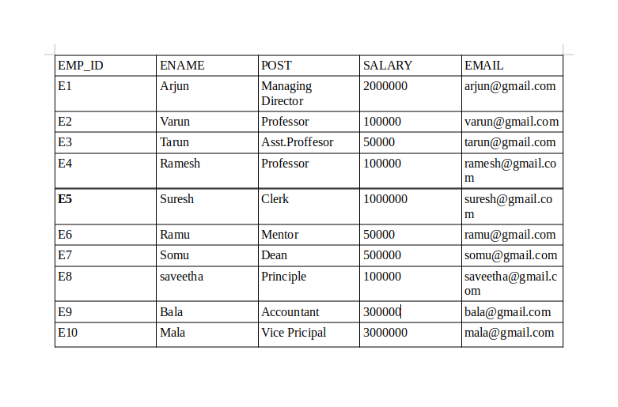
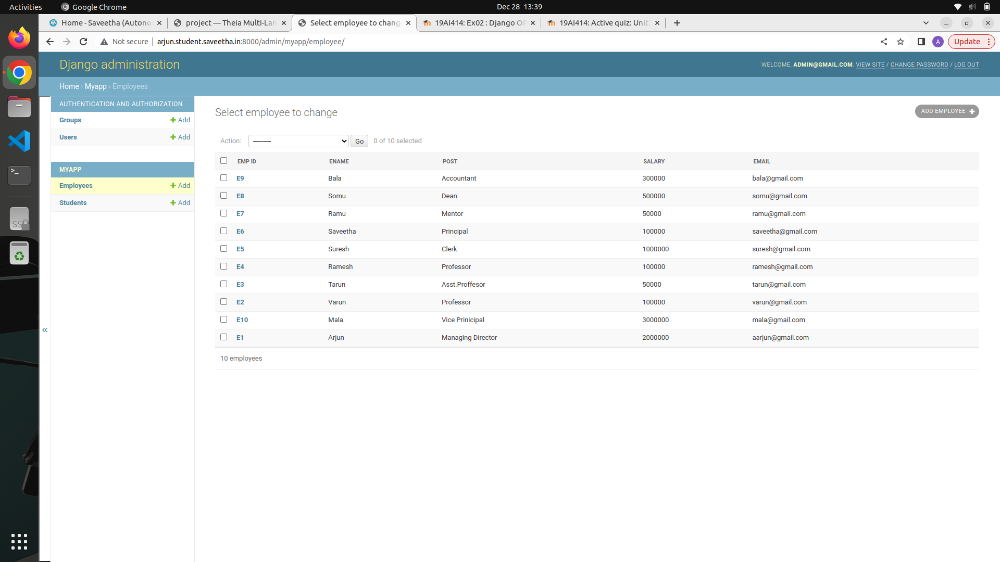
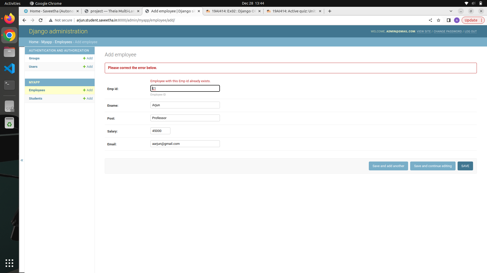

# Django ORM Web Application

## AIM
To develop a Django application to store and retrieve data from a database using Object Relational Mapping(ORM).

## Entity Relationship Diagram

Include your ER diagram here


## DESIGN STEPS

### STEP 1:
Cloning of repository.Setting up of admin models
### STEP 2:
To make all migrations in the app.Test the server.
### STEP 3:
Include the details in the tables.

Write your own steps

## PROGRAM
```
models.py:
from django.db import models
from django.contrib import admin

# Create your models here.
class Student (models.Model):
    referencenumber=models.CharField(max_length=20,help_text="reference number")
    name=models.CharField(max_length=100)
    age=models.IntegerField()
    email=models.EmailField()


class Employee (models.Model):
    emp_id=models.CharField(primary_key=True,max_length=4,help_text='Employee ID')
    ename=models.CharField(max_length=50)
    post=models.CharField(max_length=20)
    salary=models.IntegerField()
    email=models.EmailField()
    
class StudentAdmin(admin.ModelAdmin):
    list_display=('referencenumber','name','age','email')
class EmployeeAdmin(admin.ModelAdmin):
    list_display=('emp_id','ename','post','salary','email')

admin.py:
from django.contrib import admin
from .models import Student,StudentAdmin,Employee,EmployeeAdmin

# Register your models here.
admin.site.register(Student,StudentAdmin)
admin.site.register(Employee,EmployeeAdmin)
Include your code here
```
## OUTPUT

Include the screenshot of your admin page.





## RESULT
